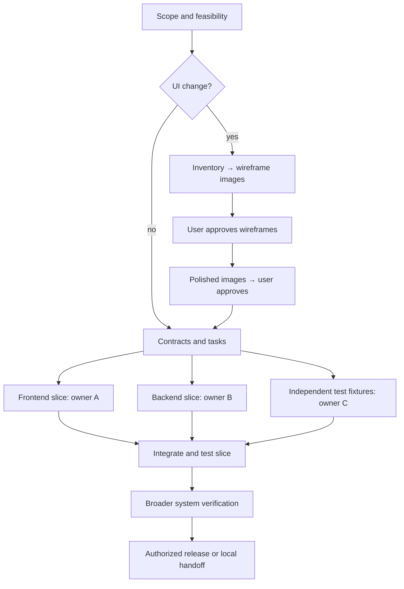

# Phases, verification and coordination

Choose a route before task creation. `select` prints the recommended task graph; adoption creates it in a new state. For new UI/changed journeys use visual. For a narrow existing bug use reproduce → fix → verify, with a scoped visual check only where affected. For no-UI work skip visual stages and record the reason in the profile. This helper does not schedule agents or run phases.

State tasks represent gate-sized units or smaller bounded tasks. The profile maps tasks to the phases below; do not create a second status ledger. Valid status values come from the schema: **Not started / Ready / Running / Blocked / Verified complete**. Ready means dependencies passed. Complete requires the appropriate evidence and actual required approvals. A task can be Blocked while genuinely independent work continues.

## Working stages

| Phase / objective | Inputs and dependencies | Action / capability and benefit | Artifacts received | Verification / completion gate | Review and what it unblocks |
|---|---|---|---|---|---|
| P0: scope/discovery | User goals; current repo/instructions; constraints | Coordinator reads relevant code/docs, inspects capabilities; limited feasibility checks reduce wasted design | Profile, acceptance criteria, selected route/tool inventory, decisions | Sources/inspected facts separated from inference; scope/testability/runtime risks resolved | User review of material product choices; unblocks scoped planning or UI inventory |
| P1: screen/state inventory (UI) | Agreed scope and journeys | Coordinator + UI module maps screens, layouts, states and controls | Coverage/interaction matrices; shared-state references | Every scoped journey/state/control accounted for; no accidental omissions or redundant exports | Review unresolved product behavior; unblocks wireframes |
| P2: wireframes (UI) | P1, feasible constraints | Design source edited by agent; configured renderer exports actual low-fidelity PNGs; UI skill prepares review | Versioned images, sources, coverage manifest | Images exist, render/display correctly, match coverage; hashes registered | Actual user approval of this set; unblocks polished design |
| P3: polished designs (UI) | Approved wireframe versions; brand direction | Design capability + renderer exports high-fidelity PNGs; optional Impeccable critique | Polished images and source, tokens/brand choices, interaction specification | Consistent typography/layout/components; applicable error/loading/etc. states covered | Separate actual user approval; unblocks final production plan |
| P4: contracts/architecture/tasks | Approved scope/design; earlier feasibility findings | Coordinator defines data models, API/error/permission contracts, ownership and tests; optional Spec Kit structures larger work | Versioned contracts, decisions, task graph, acceptance tests | Contract examples consistent, runtime feasible; architecture review; required decisions resolved | Material product changes reviewed; unblocks independent implementations |
| P5: useful increments | Passed dependencies and shared contracts | Implement UI, rules and data path in small vertical slices; native test/build tools verify each merge of work | Saved code, integration evidence, checkpoint | Appropriate format/language/build checks; behavior/error/permission tests; integration works against real parts; architecture review | Routine technical checks automatic within scope; next dependent slice becomes Ready |
| P6: broader verification | Integrated slices | Browser or native runtime exercises critical journeys; screenshots compare approved designs; relevant performance/accessibility/security checks | Test results, real screenshots, resolved discrepancy reports | Relevant criteria pass for actual code/config/fixtures; no unresolved correctness/security/contract blockers | Product acceptance where agreed; eligible for release planning |
| P7: release/handoff (optional) | P6, authorized destination/access | GitHub/CI/release and chosen hosting CLI, only if authorized | Reviewed change/release notes, migration/rollback plan, deployment receipt and smoke evidence | Actual release and applicable restore/smoke checks pass; unknown outcomes stay unresolved | Existing authorization governs publish/deploy; otherwise local handoff is complete |

All phases use core coordinator instructions. UI rendering, backend/auth/data/native/release tools are optional, enabled by the profile. Setup and capability states are in TOOLCHAIN.md; a renderer or runtime must be smoke-tested before promising its output. Spec Kit helps structure specifications and tasks; it does not replace the image approval gates or actual tests.

## Dependency graph

This is a possible split, not a required team. A small or tightly coupled change stays with one agent. Supported bounded subagents suit independent review/research/file changes in this effort. A persistent Codex chat has a separate user-visible lifecycle: create one only when explicitly requested. An OS thread and a Cloudflare runtime agent are different concepts. Native subagent support does not require an external orchestration framework.

## One concrete vertical slice: create an item

Requirement: an authorized user creates an item, sees it persisted in the list; duplicate/invalid input produces a defined error. Wireframe and polished images cover wide/narrow form, disabled submit, validation, failure and success/list. User approvals reference those image versions.

After approval the coordinator owns `contracts/items` with request/response examples, IDs, validation, permissions, error shape and idempotency expectations. Frontend owner edits only feature UI using the contract. Backend owner edits use case, trusted validation/authorization and persistence. A third bounded task can prepare test data/checks in its own files if worth its overhead. Shared components/config/contracts each retain one owner.

Integrate the first create → persist → list path during P5. Test a real API and temporary test persistence, then invalid/unauthorized/error paths and relevant UI interaction; mocks alone do not pass this checkpoint. Evidence identifies source/contracts/test fixtures/config/lockfiles, including uncommitted inputs, rather than HEAD alone. P6 checks the larger product and regressions.

If a contract changes, coordinator records the decision, identifies consuming tasks/artifacts/evidence, notifies owners, blocks affected dependents and refreshes tests and approvals where scope changes. Do not silently rehash old evidence to make it pass. The helper detects registered stale hashes; discovering unregistered impact is review work.

## Ownership and bounded handoff

Coordinator alone changes state and shared contracts. Assign each delegate: objective; included/excluded scope; input files/contract versions; exclusive owned paths or an isolated worktree; expected artifact; verification command; dependencies and handoff criteria. No overlapping edits. Do not create a worktree merely to increase agent count.

Each delegate persists a report in `project/handoffs/<task>-<version>.md`: findings/changes, files, verification with results and input versions, remaining issues, dependencies, next action. Register report and owned paths in `delegations`. This is task evidence, not a separate global status file. Coordinator inspects returned files, integrates, rechecks relevant boundaries, and updates the one authoritative state. An agent saying done does not pass a gate. Interrupted agents/processes must be checked; do not assume they survive.

Batch independent reads and checks; avoid repeated research/polling. Choose concurrency by task independence, runtime/quota, cost and ownership overhead. Track approximate phase durations, blocked causes, rework and integration failures in evidence when useful. Long blocking/merge churn calls for smaller contracts/slices or less concurrency, not a larger permanent team.

## Completion checks and enforcement

For each increment choose applicable format/lint, type/language, build, meaningful rules tests, boundary/integration checks, critical journeys, errors/validation/permissions and UI accessibility/visual review. Add dependency-boundary automation only when scale warrants it. Avoid tests that repeat implementation or arbitrary coverage targets. Existing stack-native checks take precedence over adding tools.

Correctness, security, data-integrity and broken contracts block applicable gates. Style preferences alone do not justify broad rework. Architecture quality and evidence sufficiency need review; neither a linter nor a hash proves them. Product choices need actual user approval. Instructions govern behavior but cannot technically prevent an agent editing files outside this workflow.

Keep increment evidence distinct from final breadth checks. Register meaningful inputs when the check runs; later rehashing cannot repair a stale claim. Record measured assertions, visual judgments and untested runtime behavior separately. If a final report covers more files than an earlier increment, preserve the earlier result with its original narrower scope. For a dependency/tool update, test the affected boundary; do not rerun unrelated application journeys merely to make every timestamp recent. See [update reconciliation](ADOPTION.md).

CI is a second execution environment: run relevant helper/app tests on changes and upload useful logs. Local integration happens throughout P5. A GitHub workflow only runs after repository publication/configuration; a template is not proof of a remote CI pass. For this package, run `python tests/run_acceptance.py`; the included CI example checks standard-library helpers, not optional rendering or native tooling.
